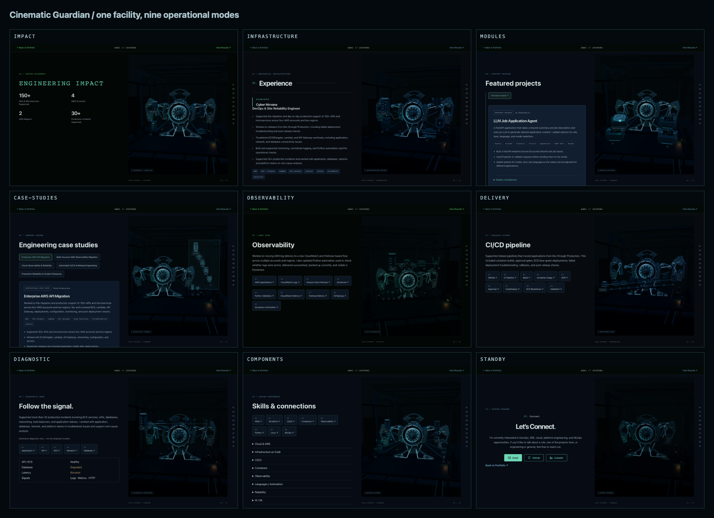

# Cinematic Guardian: complete operational experience

PR #6 extends the approved hero into one persistent machine and industrial facility. The hero model, its materials, entrance, and desktop/mobile identity composition are preserved. This is a presentation-only extension; portfolio facts, shared data, resume, default site, and deployment configuration are unchanged.

## Visual architecture

`EngineeringScene` now keeps `CinematicHero` mounted across all ten sections. `useGuardianModel` owns one abortable GLB load and disposes its geometry/materials on exit. The Guardian's articulated pivots move toward operational docking positions; the large entrance happens once per experience entry. The same `HeroEnvironment` remains mounted, with existing graphite structural ribs, floor panels, recessed rails, conduits, cyan service strips, and sparse amber practicals.

- `cinematic/operationalPose.ts`: damped housings, sleds, braces, crown, and core; restrained operational lighting and standby folding.
- `cinematic/modeComposition.ts`: section-specific station layouts, primary/supporting separation, shared project titles, and deliberate mobile selections.
- `cinematic/MechanicalModules.ts`: distinct tower, conveyor, compute cluster, sensor, shield, console, collector, processing-channel, receiver, and database forms. Rigid housings, hinged covers, and extending instruments are combined into two reusable metal/status-light batches.
- `cinematic/OperationalSystems.tsx`: active-module docking, articulated mounts, command deck, deployment rail, side projection plane, and controlled packet motion.
- `cinematic/ProjectionPaths.tsx`: one vertex-colored connection batch; selected request paths are brighter, supporting validation links dimmer.

Only the active attachment has a visible scene label; other attachment controls remain small keyboard-accessible ports through `NodeLabel`. Full names and descriptions remain in DOM; detailed portfolio content remains in the original story components. Scene selection synchronizes existing project and skill controls. No paragraphs or metric values are duplicated inside WebGL.

## Operational modes

| Section            | Presentation                                                                                                                                                                                                          |
| ------------------ | --------------------------------------------------------------------------------------------------------------------------------------------------------------------------------------------------------------------- |
| Engineering Impact | Guardian housings open into telemetry configuration; four short service/account/region/operations indicators support the authoritative DOM metrics.                                                                   |
| Experience         | Side infrastructure assemblies rotate outward; mechanically supported CLOUD, DELIVERY, SERVICES, OBSERVABILITY, and RELIABILITY stations deploy.                                                                      |
| Featured Projects  | Four stations dock around the recessed Guardian. Inactive stations fold back; the selected station moves forward, illuminates its frame, and connects to the core. Shared titles and details are unchanged.           |
| Case Studies       | Wider operations view, raised command deck, rails, two dim background telemetry screens, and selected holographic architecture above the Guardian.                                                                    |
| AWS Migration      | Five sequential primary stations with directional chevrons and one request pulse. Lambda and Step Functions are smaller, offset, and dimly connected as supporting systems.                                           |
| Observability      | Two depth layers of binary atmosphere, open data-processing housings, four-step log flow, one packet, and five secondary validation stations.                                                                         |
| CI/CD              | Nine physical stations along one sequential deployment rail. Struts and rail segments extend with staggered docking; one deployment pulse runs, then the scene rests.                                                 |
| Incident Response  | Lower key lighting, one diagnostic path, selected connection illumination, and muted degradation lighting only on Database. No flashing or alarm effects.                                                             |
| Skills             | Eight major mechanical/data modules; selecting a category deploys up to five related technologies on desktop and three on mobile, with the full list retained in DOM. The selected category remains in the small HUD. |
| Contact            | Previous stations retract, Guardian arms partially fold, core light dims, camera settles wider, and SYSTEM STANDBY remains. Binary motion slows to 12% speed and settled rendering is paced at 10 Hz.                 |

The mechanical configurations use translation and hinge rotation with damping; normal docking completes in approximately 0.75–1.25 seconds. Request/deployment pulses finish once after docking; observability sends one quiet packet at a time on a four-second cycle. Scrolling remains standard and never waits for an animation.

## Mobile composition

The existing 160–184px visual band is retained, with no header gap. Operational cameras center the selected system and keep the Guardian recognizable. Project stations use two carefully separated rows. AWS overview retains its five primary stages; observability shows only its four-step primary flow. Case studies show a simplified primary path. CI/CD shows the current stage with its neighboring stages (three total). Skills show three category attachments initially, then the selected physical category module with up to three related children. The full underlying content and controls remain in DOM.

Label depth and spacing are tailored to 320, 375, 390, and 768px. The operational status HUD is a normal DOM overlay inside the scene safe area, independent of camera projection and frame timing. Each mode shows one active short label plus its status HUD. Inactive controls retain their full accessible names without displaying competing text.

## Rendering safeguards

One Canvas, demand rendering, hidden-document pause, adaptive DPR (desktop ≤1.5, mobile ≤1.25), reduced motion, boundary/context-loss fallback, client-side navigation, and resource cleanup remain intact. Reduced-motion users see assembled static configurations without boot, packets, parallax, continuous rotation, or assembly. Phong/basic materials avoid introducing PBR environment resources. No dependencies, models, external textures, audio, physics, or post-processing were added.

The optional scene/model is requested only after entering `/experience-3d`. The default bundle contains no Three.js scene code. Its CSS is unchanged; its JavaScript changes only the generated dynamic-import target.

## Validation and visual review

Run the existing `validate-3d.mjs`, `validate-3d-quality.mjs`, `validate-3d-lifecycle.mjs`, and `validate-cinematic-hero.mjs`, plus `validate-cinematic-universe.mjs`. Provide `PLAYWRIGHT_MODULE` when Playwright is installed outside the repository and `PORTFOLIO_TEST_URL` for a running production preview.

The universe suite covers Chromium and Playwright WebKit at 1440×900, 390×844, and 375×812. It verifies one Guardian request across all nine modes, one Canvas, rendered triangles, draw-call budget, overflow, safe labels, HUD overlap, mobile header alignment, every Skills category and selected deployment stages, Back/Escape/history, resume, reduced motion, and WebGL fallback. WebKit automation is compatibility evidence, not a substitute for a physical iPhone/Safari device check.

It captures the nine required desktop sections and six mobile sections, writes `manifest.json` and `results.json`, adds selected-Skills desktop and mobile captures, and generates a self-contained desktop contact sheet (HTML and PNG). Default artifact location: `/tmp/guardian-universe/acceptance`; override with `VISUAL_OUTPUT_DIR`.

The lifecycle suite retains its 24-cycle context/RAF/listener/memory checks. Its complete-experience ceiling is now 50 draw calls, matching the reviewed persistent Guardian budget; the approved hero retains its independent 45-call ceiling. This change accommodates shared physical stations without weakening any cleanup assertions.

## Measured budget

Measurements below use the production Vite build. KB/MB are decimal units; transport total combines gzipped JS/CSS with the raw quantized GLB.

| Resource                       | Current measurement                                                                                     |
| ------------------------------ | ------------------------------------------------------------------------------------------------------- |
| Default JavaScript             | 262.59 KB raw / 82.02 KB gzip; no Three.js or model request before opting in                            |
| Optional 3D JavaScript         | 980.33 KB raw / 270.29 KB gzip (previous complete-universe build: 267.50 KB gzip)                       |
| Optional CSS                   | 8.72 KB raw / 2.55 KB gzip                                                                              |
| Guardian GLB                   | 876,912 bytes; unchanged Git blob and 19,920 model triangles                                            |
| Combined optional transport    | Approximately 1.150 MB, before server compression of the GLB                                            |
| Render calls                   | Hero 44 desktop / 42 mobile; operational states 45–47 settled; complete-experience peak 48              |
| Scene triangles                | Approximately 20,610–24,246 including bay, station geometry, and request pulse                          |
| DPR cap                        | 1.5 desktop / 1.25 mobile; adaptive fallback to 1                                                       |
| Binary instances               | Desktop: 97 intro, 94 observability, 72 other modes. Mobile: 18 intro/observability, 12 other modes     |
| Flow particles                 | At most one short-lived request/deployment packet                                                       |
| Textures                       | Generated binary glyph maps and contact-shadow gradient; no external texture assets or environment maps |
| Initial local model-ready time | Approximately 0.8–2.0 seconds in headless browser runs; this is not a production-network benchmark      |

Vite retains its existing large optional-chunk advisory. The full scene remains outside the recruiter-critical path, and this final refinement adds approximately 2.79 KB gzip versus the previous complete-universe build.

The transition timeout counts elapsed activation time independently of bounded damping steps, so low frame rates do not keep settled mechanical scenes invalidating indefinitely. Resize invalidation restarts the short camera settling window. Non-flow docking stops requesting frames after 1.4 seconds; flow scenes allow their single pulse to finish by 2.5 seconds.

## Changed files and assets

The implementation touches only `src/three`: the scene dispatcher, host overlay, operational class, shared labels, hero controller/binary/CSS, and shared `cinematic` helpers. Validation adds `scripts/validate-cinematic-universe.mjs` and strengthens `scripts/validate-3d-lifecycle.mjs`. The review documentation now includes this report and the final acceptance PNGs linked below; the PNGs are documentation-only artifacts, with no runtime imports.

No model, texture, dependency, portfolio-data, resume, default-portfolio, deployment, or infrastructure files changed. The approved Guardian asset remains the same Git blob (`ef1cda7122d9059ee308250f281d260920db5b80`) and retains its existing original-model license in `public/models/LICENSE.txt`.

## Final validation evidence

- `npm ci`, `npm run lint`, `npm run build`, and `git diff --check`: pass. The build emits only the existing optional-chunk size advisory.
- Existing 3D regression: all six widths pass (1440, 1024, 768, 390, 375, 320), including the normal portfolio, case-study variations, selected Skills, resume/social links, client-side history, Escape, reduced motion, and fallback.
- Quality suite: DPR limits, zero reduced-motion idle draws, hidden-document pause, project/Skills synchronization, settled mechanical pause, and context-loss fallback pass.
- Approved cinematic hero: Chromium at 1440/1024/390/375/320 and WebKit at 1440/1024/390/375 pass; 44 desktop / 42 mobile draw calls and no console errors.
- Lifecycle: all 24 loaded-model entry/exit cycles pass. Every exit leaves zero WebGL contexts, RAFs, and standby intervals; document pointer-move listeners return to zero and other listeners remain stable. Post-GC heap growth across the run is 1,254,336 bytes, within the existing 5 MB guard. Complete-experience peak is 48 draw calls.
- Complete-universe suite: Chromium and Playwright WebKit pass at 1440×900, 390×844, and 375×812, with every Skills category checked for clipping/overlap. No console errors, no horizontal overflow, one Canvas, one Guardian request across modes, and working Back/Escape/history/resume are confirmed. Both engines pass reduced-motion and forced-WebGL-unavailable fallback checks.
- Review captures: nine desktop + six mobile required frames, two additional selected-Skills frames (desktop and mobile), and desktop contact sheet are generated. Direct PNG links below provide full-size review without running the application.

## Final operational refinement

The approved Guardian asset, hero entrance, environment, and professional DOM composition are retained. Operational modes now communicate through different mechanical forms instead of identical labeled cradles:

- Experience uses a vertical cloud rack, roller deployment rail, clustered compute assembly, telemetry sensor, and diagnostic shield on articulated mounts.
- Projects use larger hinged command consoles; the selected console advances and opens while inactive consoles sit back with dim status strips. Only the active project title is shown.
- Case studies use a separate translucent architecture panel beside the offset Guardian. Primary shapes form a sequential projection; smaller supporting systems sit below it. Full service names remain in DOM.
- Observability uses application emitters, a funnel collector, a processing channel, and a receiver above the machine, with miniature side diagnostics and one controlled data packet.
- CI/CD retains its deployment rail, adds distinct mechanical stage housings and moving covers, and limits mobile to three neighboring stages.
- Incident Response uses a subdued diagnostic path with a forward-moving selected layer and muted amber only on the degraded database.
- Skills use physical category attachments. Selecting a category replaces the other attachments with that category's open module and its related smaller instruments. Mobile deploys at most three child modules.

Operational cameras now vary from a closer three-quarter infrastructure view to a wide command bay, side-angle processing view, lower deployment view, and quiet wide standby. Key/rim hues shift between steel blue, cyan, and green without increasing the lighting intensity. The hero camera and entrance timeline are preserved.

The universe suite additionally enforces at most three visible scene labels and at most three mobile child controls. Its overlap check includes unlabeled accessible ports using consistent array indices; clipping diagnostics identify those controls by their ARIA names.

## Visual acceptance captures

These are the final operational-refinement captures from the validated production build, copied without image alteration. Desktop frames are 1440×900; mobile frames are 390×844. They are stored only under `docs/` and are not imported or served by the application runtime.

[Desktop contact sheet](cinematic-guardian-universe/desktop-contact-sheet.png)

| Section            | Desktop                                               | Mobile (390px)                                               |
| ------------------ | ----------------------------------------------------- | ------------------------------------------------------------ |
| Engineering Impact | [View](cinematic-guardian-universe/impact.png)        | —                                                            |
| Experience         | [View](cinematic-guardian-universe/experience.png)    | [View](cinematic-guardian-universe/experience-mobile.png)    |
| Featured Projects  | [View](cinematic-guardian-universe/projects.png)      | —                                                            |
| AWS Case Study     | [View](cinematic-guardian-universe/case-study.png)    | [View](cinematic-guardian-universe/case-study-mobile.png)    |
| Observability      | [View](cinematic-guardian-universe/observability.png) | [View](cinematic-guardian-universe/observability-mobile.png) |
| CI/CD              | [View](cinematic-guardian-universe/cicd.png)          | [View](cinematic-guardian-universe/cicd-mobile.png)          |
| Incident Response  | [View](cinematic-guardian-universe/incident.png)      | —                                                            |
| Skills             | [View](cinematic-guardian-universe/skills.png)        | [View](cinematic-guardian-universe/skills-mobile.png)        |
| Contact / Standby  | [View](cinematic-guardian-universe/standby.png)       | [View](cinematic-guardian-universe/standby-mobile.png)       |

Selected Observability skill module: [Desktop](cinematic-guardian-universe/skills-selected.png) · [Mobile 390px](cinematic-guardian-universe/skills-selected-mobile.png). These additional frames show category-specific submodules deployed.
