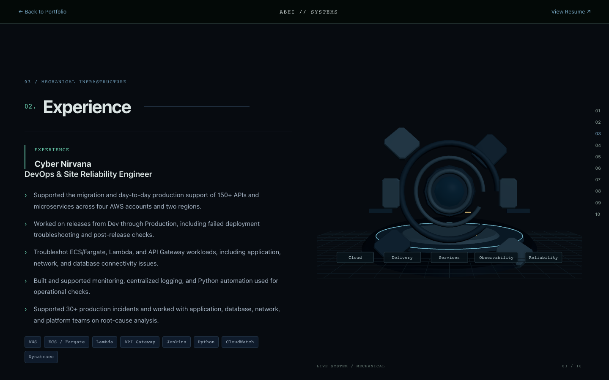
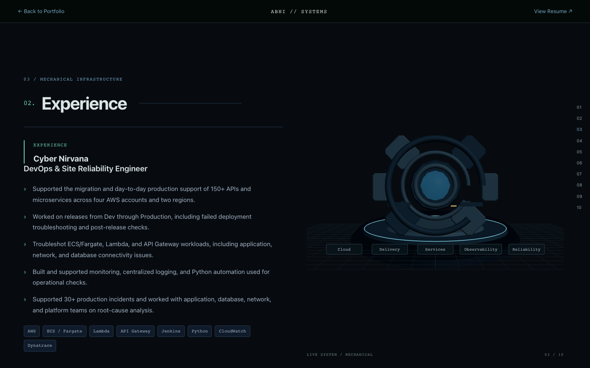
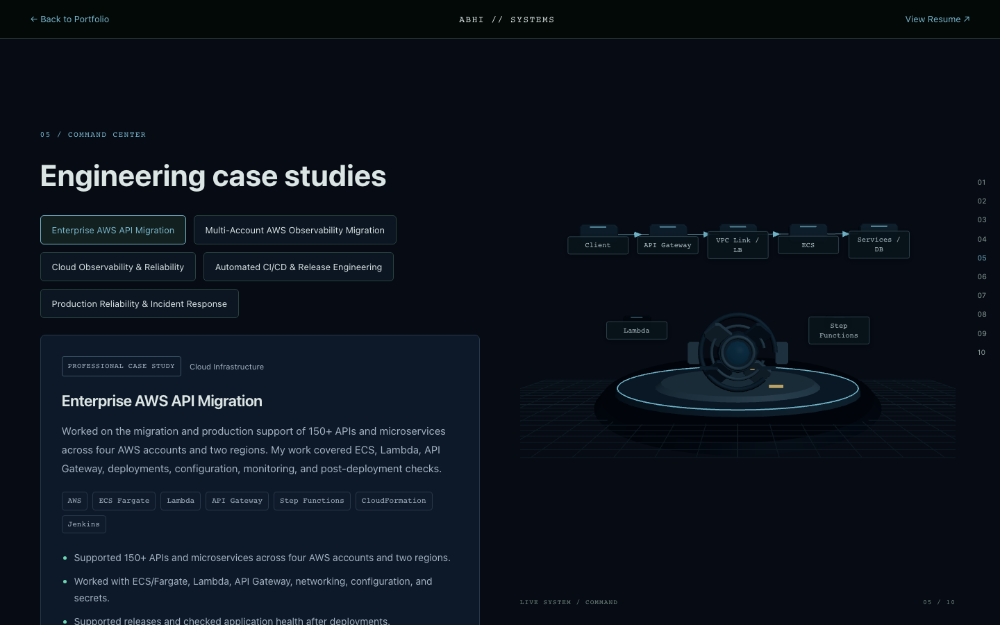
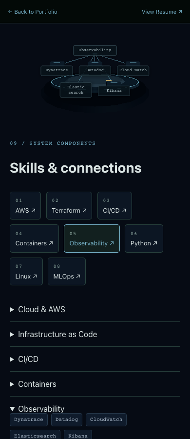

# Interactive 3D visual refinement

This is a presentation pass on `feature/interactive-3d-experience` for existing PR #5. Portfolio data, default portfolio components/styles, resume, dependencies and hosting/security configuration are unchanged.

## Composition fixes

Desktop reserves 64px at the right for story navigation, 72px below the scene for the caption, and 16px between the header and scene. A fitted perspective camera keeps the important scene contents inside a known visual envelope. Labels use responsive widths and semantic abbreviations; full names remain in aria labels and shared DOM content.

Engineering Impact values appear once in authoritative DOM telemetry. The scene uses abstract short labels and the duplicate DOM metric selector is removed. Featured project docks stay inside the frame and the first module is active on entry. Supporting AWS nodes sit in side pockets, outside the primary flow and away from the core. Skills shows categories first, then only the selected category's related technologies.

The mobile header and scene meet exactly. The visual band is 160–184px, replacing the previous 243px band at a 900px viewport height. Mobile uses four to six meaningful elements, semantic labels, and a separate compact layout. Selected technologies use two rows with responsive 60–70px labels instead of a crowded ring or single row. Dense desktop geometry is omitted from mobile diagnostic and skill diagrams.

## Mechanical transformation

The persistent assembly uses smoothstep easing for individual parts and damping for settling. It completes in approximately 1.3 seconds:

| Timing | Visible action |
| --- | --- |
| 0–280ms | Network nodes contract toward the core |
| 120–540ms | Notched inner ring rotates into alignment |
| 280–730ms | Outer ring travels forward and locks |
| 380–1070ms | Four chamfered structural panels travel inward with staggered hinge rotation |
| 700–1120ms | Side modules move into the housing |
| 830–1250ms | Connector brackets slide into docking positions |
| 1050–1300ms | Core illumination activates and the machine settles |

The final machine has a layered chamber, separate structural rings, steel panels, side modules and brackets. Gunmetal and lighter steel use different Phong shininess values. Neutral key light, subdued rim light and ambient fill provide depth without environment maps or bloom. Muted amber appears only on tiny structural details. Assembly is tied to mechanical phase entry, rather than stage hover or each scroll pixel. Reduced motion gets the assembled state immediately.

## Command surface and flow clarity

Three concentric surfaces, a raised center and instanced edge segments replace the decorative single platform. Four project modules use structural risers and docking locations. Inactive modules remain recessed; the active module moves forward, lights one indicator and connects to the core.

Primary flows use larger modules, directional arrows and clearer connections. Supporting systems are smaller, dimmer, offset and omitted from the primary request line. AWS shows the five main steps, with Lambda and Step Functions separated. Observability gives the four-stage log path priority, moves the nucleus below it and separates validation targets. A single packet represents delivery.

CI/CD has a continuous structural rail in sequence order. Individual stages translate and rotate into their docking locations with staggered timing; one progress pulse runs and stops. Mobile uses a compact overview or the selected stage's neighboring window, while the full nine-stage flow remains in DOM.

Incident diagnostics use one clear path with subdued healthy signals and muted red only on the degraded database indicator. Contact removes project/technology modules, retracts the panels, dims the core and leaves a simple standby readout and two quiet lines. No alarms, flashing, audio, movie assets, physics, external textures or imported models were added.

## Performance and validation

| Measurement | Before refinement | After refinement |
| --- | --- | --- |
| Default JS, raw | 262.57 kB | 262.57 kB |
| Default JS, gzip | 82.01 kB | 82.02 kB; hash/compression variation |
| Optional 3D JS, raw | 906.78 kB | 920.29 kB |
| Optional 3D JS, gzip | 246.80 kB | 251.14 kB, +4.34 kB / 1.76% |
| Optional CSS, gzip | 1.63 kB | 1.92 kB |
| Primary desktop draw calls | Peak 32 | Approximately 12–39, measured peak 39 |
| Binary instances | 84 desktop / 24 mobile | Unchanged; now three depth/opacity/speed layers |
| Flow particles | One | One |
| DPR maximum | 1.5 desktop / 1.25 mobile | Unchanged |
| External textures/models | None | None |
| Dependencies added in this pass | — | None |

The initial recruiter path still does not request Three.js or the experience chunk. One persistent Canvas is used. Demand rendering, hidden-document pause, adaptive DPR, reduced motion, renderer/texture disposal and WebGL fallback remain active.

`npm ci`, lint, build and diff checks pass. Vite retains its existing size warning for the optional chunk. All three existing browser scripts were rerun. The six-width matrix passes at 1440, 1024, 768, 390, 375 and 320, now checking safe label bounds, non-overlap, every prioritized case-study selection and selected Skills. It also checks default rendering, filters/details/links, one Canvas, lazy loading, client-side navigation, no horizontal overflow and no ordinary-operation console errors.

Quality checks pass for DPR caps, static reduced-motion rendering, hidden-tab pause, settled mechanical rendering, project/skill interaction, unavailable WebGL and runtime context loss. The 24-cycle cleanup check passes: zero pending animation frames and live contexts after each exit, stable document/window listener counts, and peak draw calls below the new 45-call guard. Collected heap in the final renderer run went from about 8.13 MB to 9.21 MB; the last ten cycles grew about 0.21 MB. Runtime warm-up is measurable; this is not a claim of zero cache allocation.

Browser checks and screenshots use Chromium viewport simulation, not physical-phone or cross-browser GPU benchmarks. The screenshots below are documentation assets, excluded from the application bundle.

## Acceptance screenshots

| Requested view | Screenshot |
| --- | --- |
| 1440 Digital intro | [Full size](visuals-3d/1440-digital-intro.png) |
| 1440 Mechanical, partially transformed | [Full size](visuals-3d/1440-mechanical-partial.png) |
| 1440 Mechanical, assembled | [Full size](visuals-3d/1440-mechanical-assembled.png) |
| 1440 Featured Projects | [Full size](visuals-3d/1440-featured-projects.png) |
| 1440 Command Center | [Full size](visuals-3d/1440-command-center.png) |
| 1440 Observability | [Full size](visuals-3d/1440-observability.png) |
| 1440 CI/CD | [Full size](visuals-3d/1440-cicd.png) |
| 1440 Incident Response | [Full size](visuals-3d/1440-incident-response.png) |
| 1440 Skills | [Full size](visuals-3d/1440-skills.png) |
| 1440 Standby / Contact | [Full size](visuals-3d/1440-standby.png) |
| 390 Digital intro | [Full size](visuals-3d/390-digital-intro.png) |
| 390 Mechanical | [Full size](visuals-3d/390-mechanical-assembled.png) |
| 390 Command Center | [Full size](visuals-3d/390-command-center.png) |
| 390 Skills | [Full size](visuals-3d/390-skills.png) |

Extra review images: [Engineering Impact](visuals-3d/1440-engineering-impact.png), [desktop selected Observability skills](visuals-3d/1440-skills-observability.png), [mobile selected Observability skills](visuals-3d/390-skills-observability.png).

Run `scripts/capture-3d-visuals.mjs` using the same optional Playwright tooling described in the main implementation report. `PORTFOLIO_TEST_URL` selects the preview server; `VISUAL_OUTPUT_DIR` selects the destination folder. No merge or manual deployment is performed by this pass.
